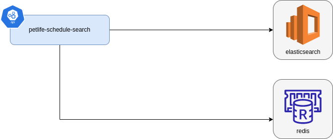
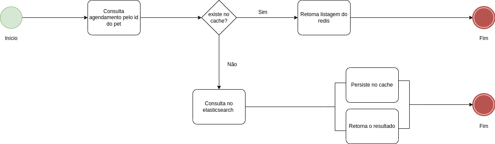

# petlife-schedule-search
Serviço responsável por consultas da agenda dos pets no ecossistema PetLife. 

## Visão Geral da Arquitetura

O serviço é composto de uma API que se comunica com Redis e Elasticsearch.

## Processo da API

## Stack
* Java 17
* Maven
* Spring Boot 3
* Elasticsearch
* Redis

